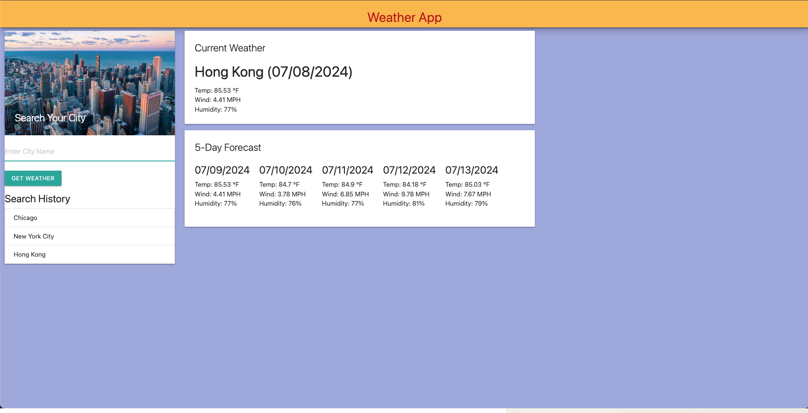

# Patrick-Hennessey-s-weather-app

My weather app uses third-party APIs to deliver detailed weather reports using HTML, CSS, JavaScript, jQuery, and Materialize CSS framework. The third-party API I used was the 5-Day Weather Forecast with the base URL of https://api.openweathermap.org/data/2.5/forecast?lat={lat}&lon={lon}&appid={API key}. Since this weather API finds the weather of specific cities using coordinates instead of the city name, I also had to use their Geocoding API to attain the weather reports. Finally, I used localStorage to store persistent data, allowing users to maintain their search history if they return to the website. 

This project allowed me to use APIs to create a dynamic website from scratch. I learned much about how APIs can be manipulated to obtain the needed data. One thing that gave me trouble was retrieving the five-day forecast. It took me a while to realize I needed to cycle through the data every 8th index because weather reports are given every three hours. And since 24 / 3 is 8, I used that number to get the weather over the next five days. I also wish I had more time to style the page to make it more aesthetically pleasing. 

## Screenshot

## License

MIT License

Copyright (c) 2024 RickHennessey87

Permission is hereby granted, free of charge, to any person obtaining a copy
of this software and associated documentation files (the "Software"), to deal
in the Software without restriction, including without limitation the rights
to use, copy, modify, merge, publish, distribute, sublicense, and/or sell
copies of the Software, and to permit persons to whom the Software is
furnished to do so, subject to the following conditions:

The above copyright notice and this permission notice shall be included in all
copies or substantial portions of the Software.

THE SOFTWARE IS PROVIDED "AS IS", WITHOUT WARRANTY OF ANY KIND, EXPRESS OR
IMPLIED, INCLUDING BUT NOT LIMITED TO THE WARRANTIES OF MERCHANTABILITY,
FITNESS FOR A PARTICULAR PURPOSE AND NONINFRINGEMENT. IN NO EVENT SHALL THE
AUTHORS OR COPYRIGHT HOLDERS BE LIABLE FOR ANY CLAIM, DAMAGES OR OTHER
LIABILITY, WHETHER IN AN ACTION OF CONTRACT, TORT OR OTHERWISE, ARISING FROM,
OUT OF OR IN CONNECTION WITH THE SOFTWARE OR THE USE OR OTHER DEALINGS IN THE
SOFTWARE.

## References

https://openweathermap.org/api/geocoding-api

https://openweathermap.org/forecast5

https://www.w3schools.com/

https://materializeweb.com/

https://stackoverflow.com/

https://jquery.com/

Xpert Learning Assistant

